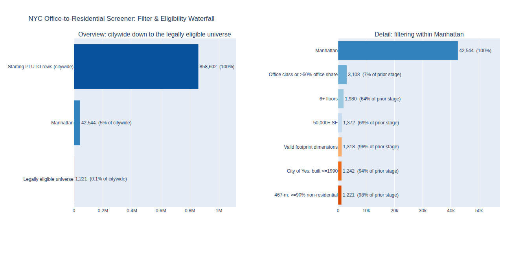

# NYC Office-to-Residential Conversion Screener

A data pipeline that screens every commercial tax lot in Manhattan against two 2024 NYC housing policies — **RPTL 467-m** and **City of Yes for Housing Opportunity** — to find which office buildings are both *legally eligible* and *physically viable* for conversion to housing, then validates the resulting shortlist against real, already-underway conversions.

**The finding, in one sentence:** policy solved the legal barrier to office-to-residential conversion, but the real binding constraint left is physical building geometry — and how "physically viable" gets defined swings the eligible share anywhere from under 1% to over 12%, even though the *relative ranking* of the best candidates stays remarkably stable.

## Background: the two policies this project screens against

- **RPTL 467-m** (enacted April 2024) — up to a 35-year property tax exemption for converting non-residential buildings to rental housing, conditional on at least 25% of units being affordable at a weighted average of 80% AMI or below, and the building having been non-residential for ≥90% of its floor area.
- **City of Yes for Housing Opportunity** (adopted Dec 2024) — expanded legal conversion eligibility from offices built before 1961 to offices built before Dec 31, 1990, relaxed light/air/layout requirements, and removed zoning obstacles that previously blocked many conversions outright.

## Pipeline overview

| Step | Script | What it does | Output |
|---|---|---|---|
| 1 | `src/01_load_and_filter.py` | Loads citywide PLUTO, cleans data-quality issues (comma-formatted numbers silently nulling out, zero-coded missing years), filters to Manhattan office buildings | `candidates.parquet` |
| 2 | `src/02_feature_engineering.py` | Derives floor-plate depth/aspect ratio, FAR headroom, assessed value per SF, building age | `candidates_features.parquet` |
| 3 | `src/03_eligibility_gates.py` | Applies the two real statutory tests (City of Yes's 1990 cutoff, 467-m's ≥90% non-residential test) | `candidates_eligible.parquet` |
| 4 | `src/04_viability_score.py` | Builds a weighted, percentile-rank viability score; runs sensitivity tests on both the score weights and the floor-plate depth cutoff | `candidates_scored.parquet` |
| 5 | `src/05_validation.py` | Checks the pipeline against 13 real, documented NYC office conversions | `validation_report.csv` |
| 6 | `src/06_visualize.py` | Builds the filter waterfall and the interactive scored candidate map | `outputs/*.html` |

Run in order — each step reads the previous step's output.

### The filter waterfall

858,602 citywide tax lots → 42,544 in Manhattan → 3,108 office-class or majority-office-share → 1,980 with 6+ floors → 1,372 at 50,000+ SF → 1,318 with valid footprint data → 1,242 built on/before 1990 (City of Yes) → **1,221 legally eligible candidates** (467-m non-residential test).



### The scored candidate map

Every legally eligible building, colored by its viability score, with the top-decile ("Tier 1") shortlist highlighted in gold and the 7 real, validated conversions from Step 5 overlaid as black-ringed red markers. Best viewed live — open `outputs/candidate_map.html` in a browser for the interactive version (hover for building details, zoom/pan the map); a static screenshot loses the interactivity and, in a sandboxed rendering environment without live internet access, the OpenStreetMap street tiles. On a normal internet connection the tiles and hover tooltips both work as shown in-repo when you run the script yourself.

## Key results

- **1,221 of 42,544** Manhattan office buildings are legally eligible under both policies.
- **Physical viability is the real constraint, and it's sensitive to assumptions.** Depending on where the floor-plate depth cutoff is drawn (50–90 ft, no legal basis for any specific value), the physically-viable share of the eligible universe swings from 0.3% to 12.5% — roughly a 40x range.
- **The ranking is far more robust than the cutoff.** Re-running the composite score with the depth weight pushed from 0.30 to 0.70 (rescaling the other weights proportionally) still produces 76–100% overlap in the top-decile ("Tier 1") shortlist — the same buildings keep surfacing near the top regardless of exactly how much weight depth gets.
- **Top-scoring candidates are older, shallower loft buildings, not deep postwar towers** — e.g. 14 Reade St, 115 W 29th St, 107 Grand St, 115 W 30th St, 209 W 38th St, mostly pre-1930 7–14 story buildings.
- **Validated against reality:** of 13 real, documented NYC office conversions, 8 matched exactly to a PLUTO record; of those, 7 reached the candidate universe and all 7 passed the legal eligibility gates. Their viability scores averaged the 53rd percentile, and 2 of 7 (245 West 55th Street, 29 West 35th Street) landed in the top decile — with only 7 data points that's suggestive rather than statistically conclusive, but it's a real, non-trivial positive signal that the score captures something genuine about what makes a conversion work.

## Known limitations (stated explicitly, not hidden)

- **Zoning-district-specific eligibility** (which C/M districts qualify) is not independently gated — could not verify a definitive, current list from primary sources in the time available.
- **Special Mixed Use District exception** (a later 1997 cutoff instead of 1990) is not identifiable from this dataset.
- **467-m's 6-unit minimum, commencement/completion window, and 25%-affordable/80%-AMI requirement** are project- or deal-level terms, not pre-conversion building characteristics PLUTO can gate on — documented, not computed.
- **Floor-plate depth is a proxy**, not a measured value — PLUTO's `bldgdepth` is a bounding-box measurement that breaks down for full-block/superblock assembled lots (58 such buildings are flagged and excluded from the depth score rather than trusted at face value).
- **Validation sample is small (13, not statistically powered)**, and address matching is exact-string rather than BBL-based — a building whose PLUTO record uses a different official address than its press-covered marketing name reports as "not found" even if it's really in the data. 5 of 13 known conversions hit exactly this limitation.

## Repo structure

```
├── src/                        # numbered pipeline scripts, run in order
│   ├── 01_load_and_filter.py
│   ├── 02_feature_engineering.py
│   ├── 03_eligibility_gates.py
│   ├── 04_viability_score.py
│   ├── 05_validation.py
│   ├── 06_visualize.py
│   └── diagnose_floorplate.py  # standalone diagnostic, not part of the numbered pipeline
├── data/
│   ├── raw/                    # gitignored — see "Getting the data" below
│   └── processed/               # gitignored — regenerated by running the pipeline
├── outputs/                     # generated HTML visuals (committed, viewable directly on GitHub via download)
├── assets/                      # static preview images used in this README
└── notebooks/                   # reserved for exploratory analysis (currently empty)
```

## Getting the data

PLUTO is too large to commit to this repo (the raw citywide CSV is ~450 MB), so `data/raw/` and `data/processed/` are gitignored. To reproduce this project:

1. Download the citywide PLUTO CSV from NYC Open Data's [Primary Land Use Tax Lot Output (PLUTO)](https://data.cityofnewyork.us/City-Government/Primary-Land-Use-Tax-Lot-Output-PLUTO-/64uk-42ks) dataset, or from [NYC Planning's official PLUTO page](https://www.nyc.gov/site/planning/data-maps/open-data/dwn-pluto-mappluto.page).
2. Save it as `data/raw/pluto.csv`.
3. Run the pipeline (below).

## Running the pipeline

```bash
# from the repo root, with your environment active
pip install -r requirements.txt

python src/01_load_and_filter.py
python src/02_feature_engineering.py
python src/03_eligibility_gates.py
python src/04_viability_score.py
python src/05_validation.py
python src/06_visualize.py
```

Each script prints its own progress, filter counts, and sanity checks as it runs. Outputs land in `data/processed/` (intermediate) and `outputs/` (final HTML visuals).

## Stack

Python, pandas, numpy, pyarrow (Parquet I/O), Plotly (charts + interactive map).

## Author

George Lin
